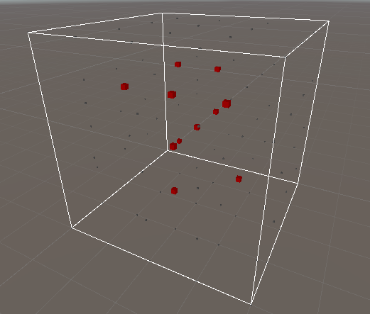
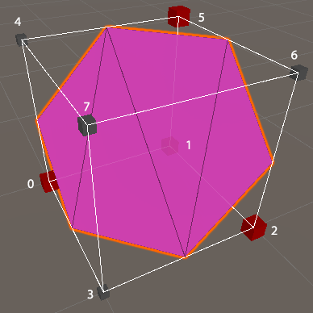
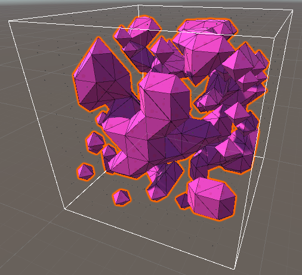
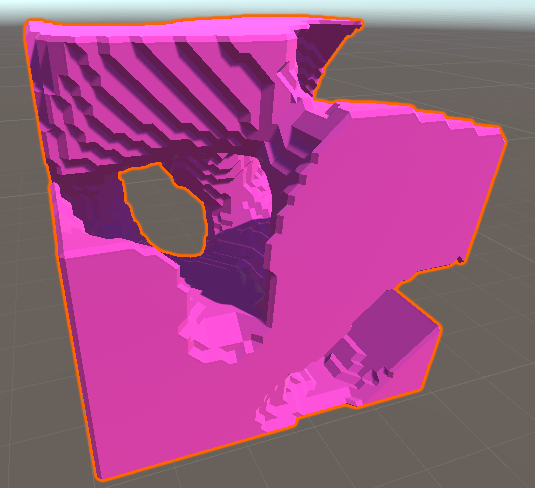
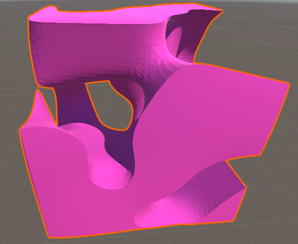

# Marching Cubes Algorithm using Unity
Marching cubes is a computer graphics algorithm for extracting a polygonal mesh of an isosurface from a three dimensional discrete scalar field.  
This is my implementation of this algorithm using Unity.

## Generating Values
First, we will need a  function that takes in a point in 3D space and gives out a single value, we can use this function to sample points in a particular region of space in regular intervals. I used a function that returns a random value between 0 and 1, a better implementation would be to use a noise function, like Perlin noise or Simplex noise.  
We then set a value called *Surface Level*, the points below the *Surface Level* will disappear. Those points we can think of them as in empty space and the points above the *Surface Level* we will think of as on the surface of inside of a certain shape, the goal of the **Marching Cubes Algorithm** is to construct the surface of that shape from triangles so we can display it as a mesh.



## Algorithm
To think about this problem we can simplify it to a single cube, there are 8 corner points, each can be either inside or outside of the shape which gives as 2^8 or 256 possible configurations, we can use a triangulation table to represent these states.  
```csharp
public static class TriangluationTable
{
    private static readonly int[,] triangleConnectionTable = new int[,]
	   {
		{-1, -1, -1, -1, -1, -1, -1, -1, -1, -1, -1, -1, -1, -1, -1, -1},
		{0, 8, 3, -1, -1, -1, -1, -1, -1, -1, -1, -1, -1, -1, -1, -1},
        
        ...

        {0, 3, 8, -1, -1, -1, -1, -1, -1, -1, -1, -1, -1, -1, -1, -1},
		{-1, -1, -1, -1, -1, -1, -1, -1, -1, -1, -1, -1, -1, -1, -1, -1}
       };
}
```

So let's take this case for example:  



Corner points 0, 1, 2 and 5 are active which we can interpret as configuration 11100100 or configuration 228, this is the code for calculating that index:

```csharp
// gets the index of this particular cube in the triangulation table
int cubeIndex = 0;
for (int i = 0; i < 8; i++)
{
    if(values[i] > surfaceLevel)
    {
        cubeIndex |= 1 << i;
    }
}
```

now we can lookup that entry in the triangulation table

```csharp  
{4, 11, 7, 9, 11, 4, 9, 2, 11, 9, 1, 2, -1, -1, -1, -1}
```
this tells me to join edges 4, 11, 7 and 9, 11, 4 and 9, 2, 11 and 9, 1, 2 to form 4 triangles.  

All we need to do now is march through the entire space and construct the mesh one cube at a time, Thus, **Marching Cubes**.  




using the *FastNoiseLite* library from [Jordan Peck](https://github.com/Auburn/FastNoiseLite), we can apply a noise function instead of random values, this can give us a multitude of shapes depending on the noise function used, using *Simplex Noise* we can generate terrain like meshes.



We can apply a little bit of smoothing on the result to obtain realistic results instead of the blocky look.

